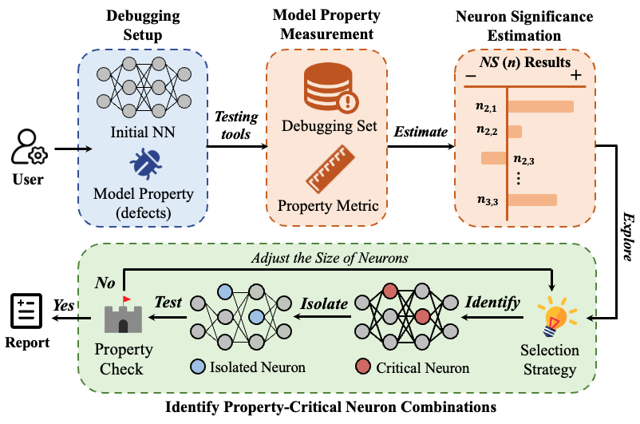

# Isolation-Based Debugging for Neural Networks (ISSTA 2024)

See the <a href="https://dl.acm.org/doi/abs/10.1145/3650212.3652132" target="_blank">ISSTA 2024 paper</a>  for more details. 

## Prerequisite (Py3.6 & Tf2)
The code are run successfully using Python 3.6 and Tensorflow 2.6.0.

We recommend using conda to install the tensorflow-gpu environment
```shell
conda create -n tf2-gpu tensorflow-gpu==2.6.0
conda activate tf2-gpu
```

Checking installed environments
```shell
conda env list
```


## Work Flow



## Publication 
```
@inproceedings{idnn,
  author    = {Jialuo Chen, Jingyi Wang, Youcheng Sun, Peng Cheng, Jiming Chen},
  title     = {Isolation-Based Debugging for Neural Networks},
  booktitle = {33rd ACM SIGSOFT International Symposium on Software Testing and Analysis, ISSTA 2024, Vienna, Austria, September 16-20, 2024},
  year      = {2024},
}
```
